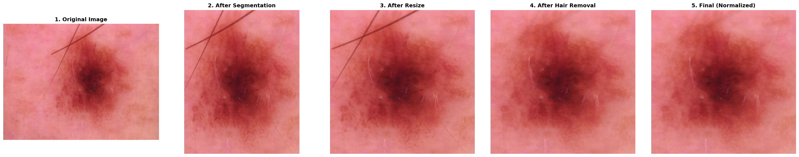
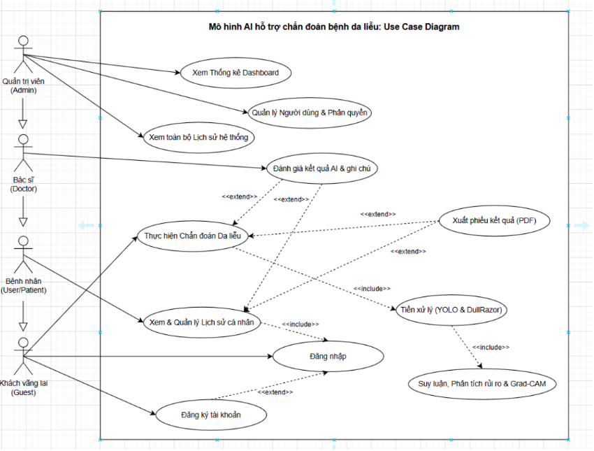
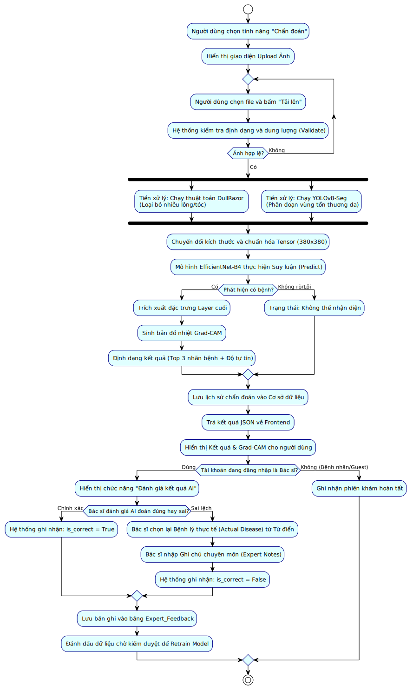
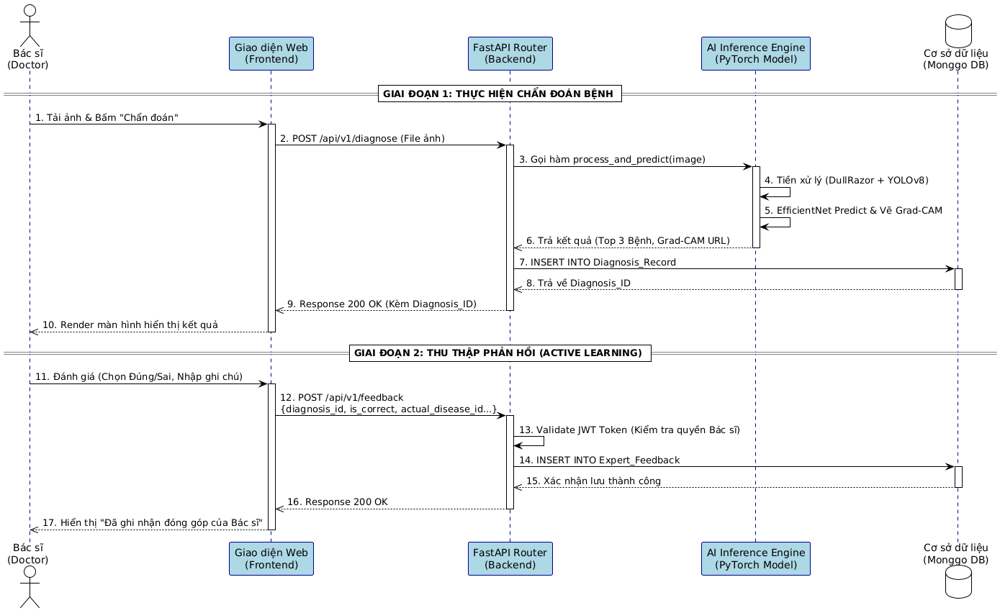
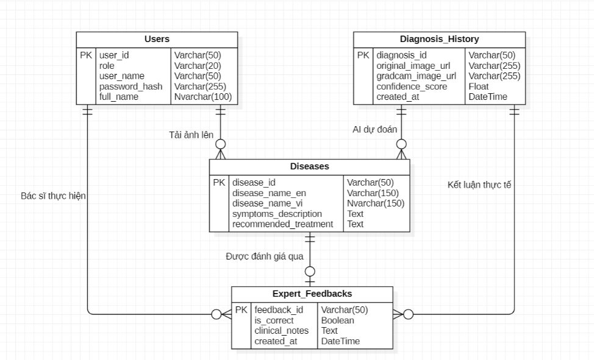
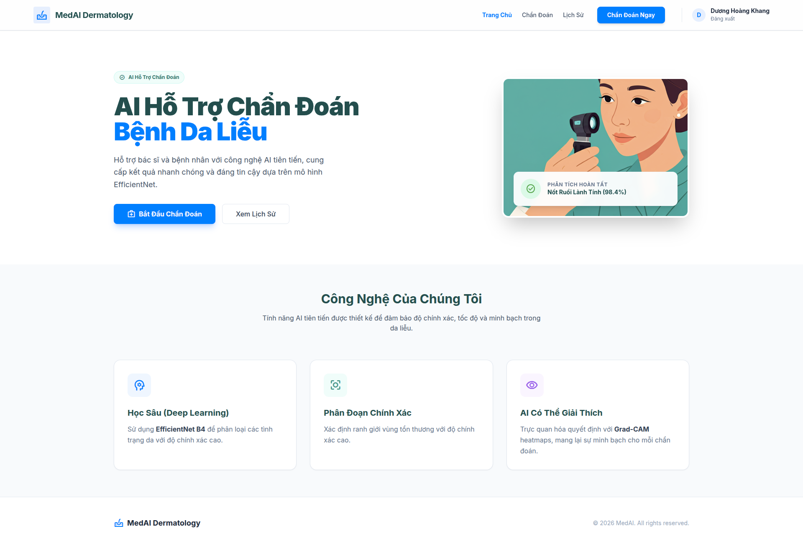
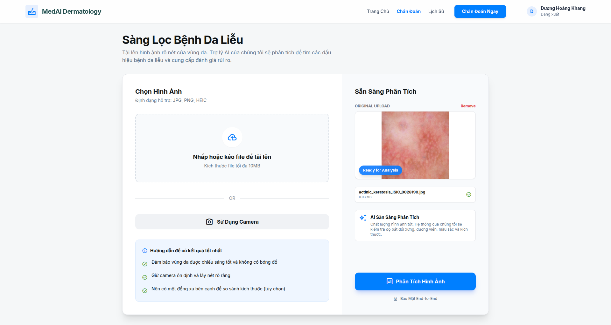
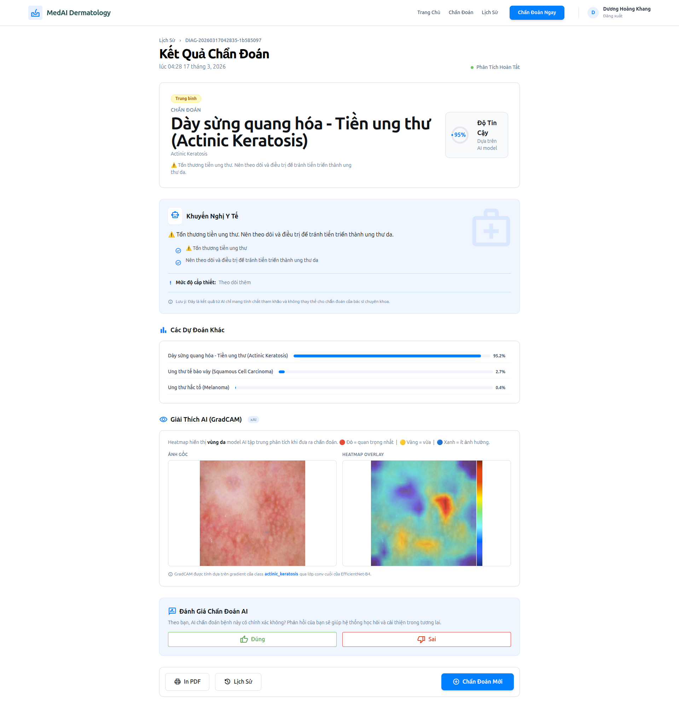
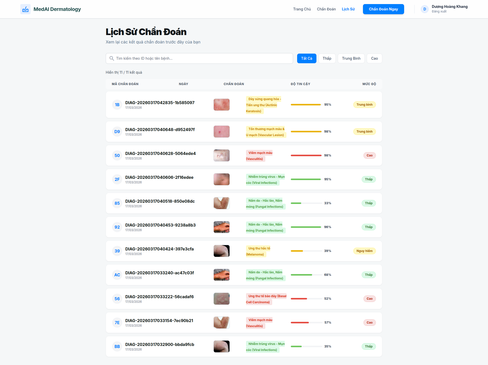

# MEDAI DERMATOLOGY: HỆ THỐNG AI HỖ TRỢ CHẨN ĐOÁN BỆNH LÝ DA LIỄU TỪ ẢNH DA

**Tác giả:** Dương Hoàng Khang - 223952 - DH22KPM01  

**Chuyên ngành:** Kỹ thuật Phần mềm (Software Engineering)  
**Ứng dụng công nghệ:** Deep Learning (EfficientNet), Image Segmentation (YOLOv8), FastAPI, MongoDB & Kiến trúc triển khai phân tán.

📄 **Đường dẫn file báo cáo chi tiết:**  
`research/reports/Bao_cao_do_an_2.docx`

---

## 📌 TÓM TẮT ĐỀ TÀI

Đề tài "MedAI Dermatology" được thực hiện với mục tiêu xây dựng một hệ thống Trí tuệ Nhân tạo hỗ trợ chẩn đoán từ xa 24 nhóm bệnh lý da liễu phổ biến (bao gồm các loại ung thư nguy hiểm như Melanoma).

Dự án sử dụng bộ dữ liệu quy mô lớn (>41.000 ảnh) từ ISIC, DermNet NZ và PAD-UFES-20. Điểm đột phá của hệ thống nằm ở Luồng tiền xử lý đa tầng: Dùng YOLOv8 để cắt nền và DullRazor để tẩy nhiễu lông, giúp mạng nơ-ron EfficientNet-B4 tập trung 100% vào tổn thương. Nhờ áp dụng hàm suy hao Asymmetric Loss, mô hình (phiên bản V3.0) đã khắc phục thành công tình trạng mất cân bằng dữ liệu y tế, đạt độ chính xác (Accuracy) 88.5% và F1-Macro 0.880. Hệ thống được triển khai thực tế dưới dạng Web Application có tích hợp bản đồ nhiệt Grad-CAM để giải thích quyết định của AI, hỗ trợ trực tiếp cho quy trình khám sàng lọc của bác sĩ.

---

## CHƯƠNG 1: GIỚI THIỆU

**Thực trạng:** Khám lâm sàng da liễu phụ thuộc nhiều vào kinh nghiệm bác sĩ. Tình trạng quá tải tại bệnh viện làm tăng nguy cơ bỏ lọt các bệnh ung thư da giai đoạn đầu.

**Giải pháp (MedAI):** Đóng vai trò như một hệ thống CAD (Computer-Aided Diagnosis) - "người bác sĩ thứ hai" tự động phân tích ảnh chụp từ điện thoại, khoanh vùng tổn thương và đưa ra tỷ lệ dự đoán, giúp phân luồng bệnh nhân nhanh chóng và chính xác.

---

## CHƯƠNG 2: CƠ SỞ LÝ THUYẾT

Hệ thống là sự kết hợp nhuần nhuyễn giữa Kỹ thuật Phần mềm và Trí tuệ Nhân tạo:

- **Hạ tầng Web:** Sử dụng FastAPI (xử lý bất đồng bộ AI mượt mà) và MongoDB (lưu trữ linh hoạt cấu trúc JSON/BSON phức tạp sinh ra từ AI).

- **Lõi Trí tuệ Nhân tạo:**  
  * Mạng tích chập EfficientNet-B4 (Tối ưu hóa sức mạnh bằng Compound Scaling).

- **Tiền xử lý nhiễu:** Thuật toán hình thái học DullRazor và Phân đoạn ảnh YOLOv8-Segmentation.  

- **Tối ưu hóa Loss:** Asymmetric Loss giải quyết phân phối đuôi dài (Long-tail) của dữ liệu y tế.

- **Trực quan hóa (Explainable AI):** Bản đồ nhiệt Grad-CAM.

---

## CHƯƠNG 3: PHÂN TÍCH VÀ THIẾT KẾ MÔ HÌNH

### 3.1. Các Sơ Đồ Thiết Kế Hệ Thống (UML)

Mô hình hóa tương tác giữa Bệnh nhân, Bác sĩ, Quản trị viên và Hệ thống lõi AI. Tích hợp vòng lặp Active Learning (Thu thập phản hồi).

Minh họa luồng chạy song song của YOLOv8 và DullRazor trước khi đưa vào mô hình dự đoán.

Trình tự giao tiếp API giữa Frontend, FastAPI Backend, AI Inference Engine và Database.

---

### 3.2. Thiết Kế Cơ Sở Dữ Liệu (ERD)

Kiến trúc dữ liệu tinh gọn với 4 thực thể cốt lõi: Users, Diseases, Diagnosis_History, và Expert_Feedbacks.

---

### 3.3. Kiến Trúc Triển Khai Phân Tán (Decoupled Architecture)

- **Frontend:** Triển khai trên VPS nội địa (iNet / 1Panel) đảm bảo tốc độ tải trang cực nhanh cho người dùng Việt Nam.

- **Backend & AI Engine:** Đóng gói bằng Docker và triển khai độc lập trên nền tảng máy chủ chuyên dụng Hugging Face Spaces, đảm bảo tài nguyên tính toán không làm treo máy chủ Web.

---

## CHƯƠNG 4: KẾT QUẢ THỰC NGHIỆM VÀ GIAO DIỆN HỆ THỐNG

### 4.1. Lịch sử Tiến hóa Mô hình

- **V1.0 (Baseline):** Dùng TensorFlow & EfficientNet-B3 trên 8 lớp bệnh. Bị nhiễu phông nền, Accuracy chỉ đạt ~73%.

- **V2.0+ (Nâng cấp):** Chuyển sang PyTorch & EfficientNet-B4, mở rộng 24 lớp bệnh. Áp dụng YOLOv8 cắt nền, Accuracy đạt 86.2%.

- **V3.0 (Hiện tại):** Tích hợp Asymmetric Loss chống mất cân bằng nhãn. Đạt chuẩn y khoa với Accuracy 88.5%, F1-Macro 0.880.

---

### 4.2. Phân Tích Chỉ Số AI Trực Quan

Ma trận nhầm lẫn chứng minh khả năng nhận diện xuất sắc các nhóm bệnh ung thư nguy hiểm (Recall cao).

Giá trị AUC trung bình đạt 0.95, thể hiện năng lực phân biệt bệnh lý vượt trội.

---

### 4.3. Giao Diện Hệ Thống Thực Tế

Giao diện thiết kế phẳng (Flat Design) thân thiện, chuẩn y tế.

Kết quả chẩn đoán minh bạch, vùng đỏ trên Grad-CAM bám sát vào vùng tế bào viêm nhiễm/khối u, chứng minh AI ra quyết định có cơ sở.

---

## CHƯƠNG 5: KẾT LUẬN VÀ HƯỚNG PHÁT TRIỂN

### 5.1. Kết Quả Đạt Được

- Xây dựng thành công hệ thống MedAI Dermatology phân loại tự động 24 nhóm bệnh da liễu.

- Đạt các chỉ số đo lường học máy ấn tượng nhờ kết hợp tốt tiền xử lý (YOLO+DullRazor) và tối ưu hóa (Asymmetric Loss).

- Triển khai thực tế thành công với kiến trúc phân tán ổn định.

---

### 5.2. Hướng Phát Triển Tương Lai

- **Thu thập dữ liệu nội địa:** Mở rộng tập dữ liệu với hình ảnh bệnh nhân Việt Nam để AI làm quen với sắc tố da người châu Á.

- **Tích hợp Generative AI:** Kết hợp LLM (như Gemini/ChatGPT) để tự động sinh báo cáo tư vấn dễ hiểu từ kết quả của EfficientNet.

- **Phát triển Mobile App:** Đóng gói thành ứng dụng iOS/Android tận dụng camera chất lượng cao để khám sàng lọc tại nhà.

---

💡 **Chi tiết hướng dẫn cài đặt và thiết lập Docker/Môi trường ảo (Local/Production) vui lòng xem tại phần Phụ Lục của file báo cáo Word.**